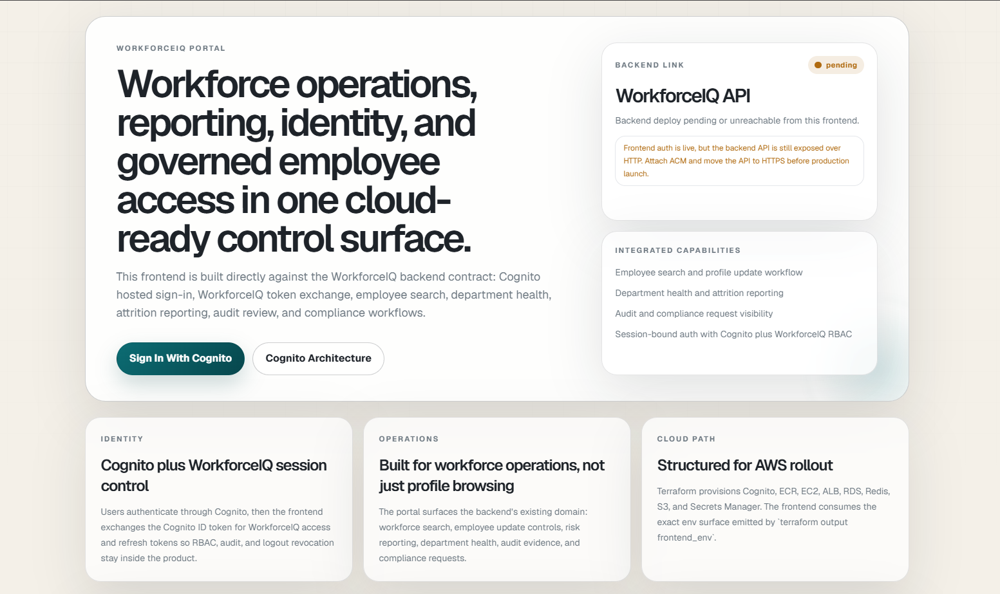

# WorkforceIQ AI

<p align="center">
  
</p>

WorkforceIQ AI is a workforce intelligence platform designed for organizations that need more than an employee directory and less chaos than spreadsheet-led HR operations. It combines governed employee data access, workforce reporting, auditability, role-based controls, and ML-assisted insight into a backend platform that can support internal pilots, controlled demos, and pre-production rollout.

This repository is the working product foundation: Flask API, workforce domain model, authentication, RBAC, reporting, search, audit trails, async task wiring, migrations, tests, and AWS deployment paths.

## At A Glance

| Category | Detail |
|---|---|
| Positioning | Workforce operations and intelligence backend |
| Primary business audience | Leadership, HR operations, department heads, internal platform teams |
| Technical audience | Engineering managers, platform engineers, solution architects, GitHub reviewers |
| Current maturity | Serious demo, internal pilot, and pre-production foundation |
| Core stack | Flask, SQLAlchemy, Alembic, MySQL or SQLite, Redis, Celery, JWT, optional Elasticsearch |
| Deployment options in repo | Single-host AWS path and managed AWS infrastructure path |

## Executive Brief

Most workforce systems fail in one of two ways: they either become passive record stores, or they scatter critical workforce information across too many tools to govern cleanly. WorkforceIQ is built to close that gap.

For leadership teams, the platform is meant to improve three things:

- decision speed around workforce performance, attrition exposure, and department health,
- control over who can access or change sensitive employee records,
- confidence that workforce reporting and audit history are coming from a governed system rather than manually assembled exports.

The commercial case is straightforward: fewer fragmented workflows, tighter access boundaries, faster reporting cycles, and a stronger foundation for workforce analytics.

## Why It Matters In Enterprise Reviews

When a board, operating committee, or executive sponsor evaluates software like this, the questions are usually not about frameworks first. They are about operating risk, governance, and whether the system can become a dependable layer in the business.

| Enterprise concern | WorkforceIQ response |
|---|---|
| Workforce data is fragmented across systems and spreadsheets | Central workforce schema with joined employee, department, role, review, and prediction views |
| Managers and HR need different access boundaries | Role-aware authorization and scoped record access |
| Reporting takes too long and depends on manual reconciliation | API-backed reporting endpoints and reusable service layer |
| Attrition and department health are identified too late | Stored prediction support, health scoring, and structured reporting workflows |
| Compliance reviews need traceable evidence | Audit logging, session tracking, and compliance request workflows |
| Leadership wants a modernization path without jumping straight into a large-suite replacement | Pilot-to-pre-production architecture with clear hardening path |

## What This Repository Delivers

This codebase is not a pitch artifact. It contains working backend capabilities that a technical team can inspect, run, extend, and deploy.

| Capability area | What is implemented |
|---|---|
| Workforce records | Employees, departments, roles, reviews, sessions, organizations, compliance requests, audit logs, predictions |
| Authentication | JWT login, OIDC token exchange, refresh-token rotation, session revocation, development token flow, MFA setup and verification, persisted user accounts |
| Authorization | Role-aware access control for employee views, reports, and audit surfaces |
| Reporting | Employee profile summary, department health check, attrition risk reporting |
| Search | SQL-based employee search with optional Elasticsearch integration path |
| Governance | Audit log writes for access-sensitive actions and record updates |
| Async foundation | Celery worker wiring for search and reporting background jobs |
| Delivery | Local developer mode, Docker support, AWS pilot path, managed AWS infrastructure path |

## Business Value By Audience

### For leadership

- A clearer operating picture across departments, performance signals, and workforce risk.
- A more defensible access and audit model than ad hoc exports and spreadsheet circulation.
- A practical foundation for internal workforce digitization without committing immediately to a full-suite replacement.

### For HR and operations

- Faster access to employee context, reporting, and role-aware workflows.
- Better consistency in how workforce data is updated, reviewed, and traced.
- A path to ML-assisted decision support without treating model output as uncontrolled truth.

### For engineering and platform teams

- A modular Flask service architecture instead of route-heavy business logic.
- Migration-backed schema management and test coverage.
- Real deployment assets, not only local mockups.
- Straightforward extension points for search, reporting, auth, and infrastructure hardening.

## Technical Evaluation

### Architecture

The backend is organized around services and operational boundaries rather than a thin controller layer over direct queries.

- Application entry point: [run.py](run.py)
- App package: [workforceiq](workforceiq)
- API routes: [workforceiq/api](workforceiq/api)
- Business services: [workforceiq/services](workforceiq/services)
- Security and MFA: [workforceiq/security](workforceiq/security)
- Database migrations: [migrations](migrations)
- Deployment and operations scripts: [scripts](scripts)

Key implementation characteristics:

- Flask application factory with environment-based configuration
- SQLAlchemy ORM models with organization-aware domain structure
- Alembic migration scaffolding
- JWT-secured API access
- Redis-backed rate limiting and queue support
- Celery integration for background execution
- Optional Elasticsearch integration path
- Dockerized deployment shape for cloud environments

### Core domain model

Primary entities represented in the current schema:

- `organizations`
- `employees`
- `departments`
- `roles`
- `performance_reviews`
- `ml_predictions`
- `rbac_roles`
- `user_accounts`
- `user_sessions`
- `audit_logs`
- `compliance_requests`

### API surface

Primary endpoints currently exposed:

- `GET /api/health`
- `GET /api/health/live`
- `GET /api/health/ready`
- `POST /api/auth/token`
- `POST /api/auth/login`
- `POST /api/auth/sso/exchange`
- `POST /api/auth/refresh`
- `POST /api/auth/logout`
- `POST /api/auth/mfa/setup`
- `POST /api/auth/mfa/verify`
- `GET /api/employees/<employee_id>`
- `PATCH /api/employees/<employee_id>`
- `GET /api/search/employees`
- `GET /api/departments/<department_id>/health`
- `GET /api/reports/attrition-risk`
- `GET /api/audit-logs`
- `POST /api/compliance/requests`
- `GET /api/compliance/requests`

## What GitHub Reviewers Will See

For technical diligence, the useful signal in this repository is that it already captures the concerns that typically separate a product foundation from a demo-only prototype.

- Clear separation between API routes and business services
- Real environment configuration files and deployment scripts
- Migration support instead of schema-by-hand drift
- Authentication and RBAC built into the application layer
- Audit logging and compliance-aware flows
- Test coverage across core behavior
- Dependency-level readiness checks and backup verification utilities
- AWS deployment assets for both low-cost and more managed operating models

This makes the repo suitable for:

- architecture review,
- internal technical due diligence,
- solution prototyping,
- integration planning,
- platform extension work,
- pilot deployment and pre-production validation.

## Local Developer Setup

```powershell
python -m venv .venv
.venv\Scripts\Activate.ps1
pip install -r requirements.txt
Copy-Item .env.example .env
python scripts\seed_demo_data.py
python run.py
```

Local evaluation can use SQLite for convenience. Staging and production should use MySQL.

## Demo And Evaluation Access

For controlled demos and QA, the project includes seeded identities such as:

- `super-admin-1`
- `hr-manager-1`
- `dept-head-eng-1`
- `employee-priya`
- `auditor-1`

Those identities are appropriate for development and evaluation only.

## Deployment Paths

### Lower-cost AWS pilot and pre-production path

- [docs/aws-free-tier-deployment.md](docs/aws-free-tier-deployment.md)
- [scripts/deploy_active_aws_free.ps1](scripts/deploy_active_aws_free.ps1)

### Broader managed AWS infrastructure path

- [docs/aws-deployment.md](docs/aws-deployment.md)

## Current Delivery Status

WorkforceIQ should be represented honestly.

Today it is strongest as:

- a serious client demonstration backend,
- an internal pilot platform,
- a pre-production workforce operations foundation,
- a base for enterprise hardening by an internal engineering team.

It is beyond a throwaway prototype, but it is not yet the finished end-state of a large-enterprise deployment.

Already in place:

- authentication and authorization,
- enterprise OIDC token exchange on top of local JWT sessions,
- session-bound refresh token rotation and logout revocation,
- migrations,
- reporting and search,
- auditability,
- cloud deployment paths,
- testable backend behavior,
- live single-host AWS validation.

Typical next steps for full enterprise rollout:

- broader identity federation such as SAML, SCIM, and group-to-role mapping
- managed data services and backup policy enforcement
- hardened domain and HTTPS routing
- centralized observability and alerting
- formal resilience and scale testing
- finalized compliance and retention workflows

## Repository Layout

```text
workforceiq/                 Core Flask application
workforceiq/api/             API routes
workforceiq/services/        Business logic, search, and reporting services
workforceiq/security/        MFA and security-related helpers
migrations/                  Alembic migration history
scripts/                     Seed, backup, bootstrap, and deploy helpers
infra/aws/                   Managed AWS infrastructure path
infra/aws-free/              Lower-cost AWS single-host deployment path
docs/                        Deployment and operating notes
tests/                       Test suite
```

## Evaluation Lens

If you are reviewing WorkforceIQ from the business side, the core question is whether it can become a governed system of workforce operations rather than another reporting fragment.

If you are reviewing it from the engineering side, the core question is whether the codebase already contains the right operational primitives to evolve into a production-grade platform.

This repository is intended to answer yes to both questions, while staying honest about what is already implemented and what still belongs in the next hardening phase.
